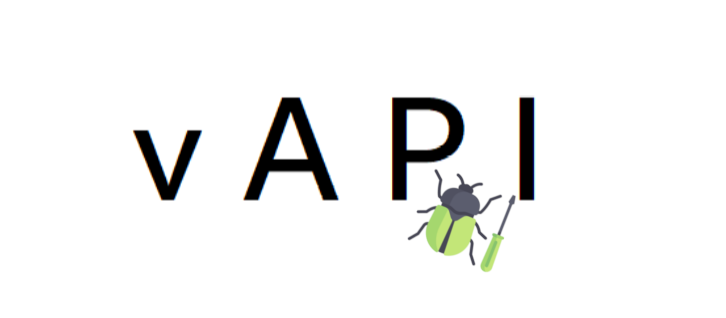

# vAPI [](https://twitter.com/intent/tweet?text=Check%20out%20vAPI%20on%20Github!&url=https://github.com/roottusk/vapi&via=vk_tushar&hashtags=apisecurity,apitop10,owasp)

[](https://github.com/roottusk/vapi#installation-docker) 
[](https://www.travis-ci.com/roottusk/vapi)
[](https://www.gnu.org/licenses/gpl-3.0)
[](https://github.com/roottusk/vapi) 
[](https://github.com/roottusk/vapi)
[](https://github.com/roottusk/vapi/issues)
<p align="center">

</p>

vAPI is Vulnerable Adversely Programmed Interface which is Self-Hostable PHP Interface that mimics OWASP API Top 10 scenarios in the means of Exercises. 


# Requirements

* Apache Server 
* MySQL
* PostMan
* MITM Proxy

# Installation (Docker)

```bash
docker-compose up -d
```

# Installation (Traditional)

## Copying the Code

```bash
cd <your-hosting-directory>
```

```bash
git clone https://github.com/roottusk/vapi.git
```

## Setting Up Postman

- Import `vAPI.postman_collection.json` in Postman
- Import `vAPI_ENV.postman_environment.json` in Postman

OR

Use Public Workspace 

https://www.postman.com/roottusk/workspace/vapi/

## Setting up the Database

Import `vapi.sql` into MySQL Database

Configure the DB Credentials in the `vapi/db/var.php`


# Usage

Browse `http://localhost/vapi/` for Documentation

# Mentions and References
[1] https://apisecurity.io/issue-132-experian-api-leak-breaches-digitalocean-geico-burp-plugins-vapi-lab/

[2] https://dsopas.github.io/MindAPI/references/

[3] https://dzone.com/articles/api-security-weekly-issue-132

[4] https://owasp.org/www-project-vulnerable-web-applications-directory/

[5] https://github.com/arainho/awesome-api-security

# Walkthroughs/Writeups

‼️ Spoiler Alert

[1] https://cyc0rpion.medium.com/exploiting-owasp-top-10-api-vulnerabilities-fb9d4b1dd471

# Acknowledgements

* The icon and banner uses image from [Flaticon](https://www.flaticon.com/free-icon/bug_190835)

